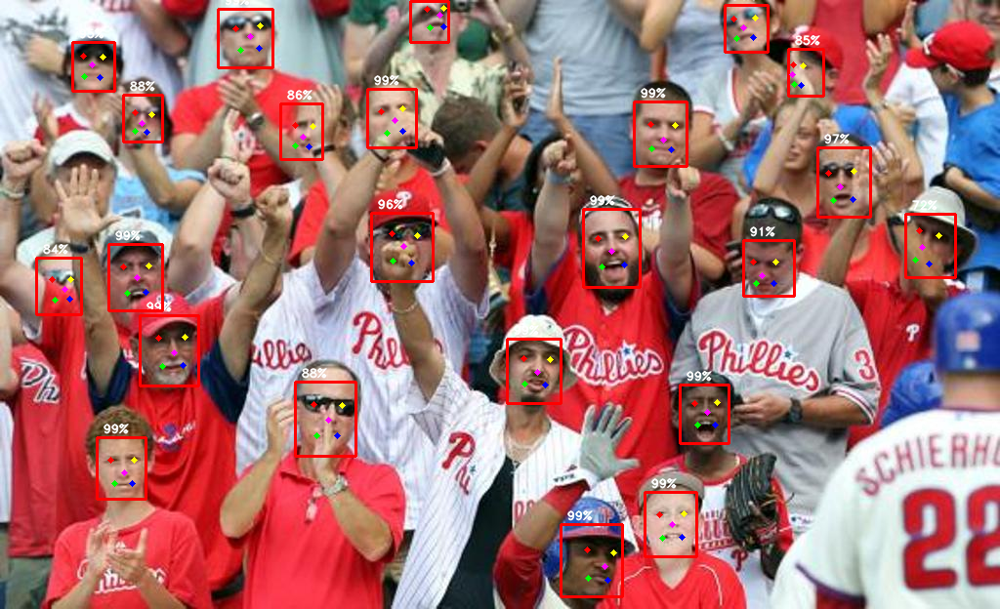
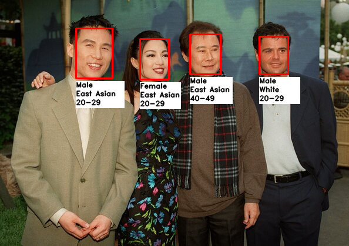

# EasyFace: Easy Face Analysis Tool with SOTA Models

## Table of Contents
* [Supported Models](#supported-models)
* [Benchmarks & Pretrained Models](#benchmarks--pretrained-models)
* [Requirements](#requirements)
* [Usage](#usage)
    * [Face & Landmark Detection](#face--landmark-detection)
    * [Face Recognition](#face-recognition)
    * [Facial Expression Recognition](#facial-expression-recognition)
    * [Facial Attribute Classification (Gender, Age, Race)](#facial-attribute-classification)
* [References](#references)


## Supported Models

Face & Landmark Detection

* [RetinaFace](https://arxiv.org/abs/1905.00641) (CVPR 2020)

Face Recognition

* [AdaFace](https://arxiv.org/abs/2204.00964) (CVPR 2022)

Facial Expression Recognition

* [DAN](https://arxiv.org/abs/2109.07270) (ArXiv 2021)

Facial Attribute Classification

* [FairFace](https://arxiv.org/abs/1908.04913v1) (WACV 2021)
* [FSCL](https://arxiv.org/abs/2203.16209v1) (CVPR 2022) (Coming Soon...)


## Benchmarks & Pretrained Models

Check the models' comparison and download their pretrained weights from below.

* [Face & Landmark Detection](./easyface/detection/README.md#pretrained-models)
* [Face Recognition](./easyface/recognition/README.md#pretrained-models)
* [Facial Expression Recognition](./easyface/emotion/README.md#benchmarks--pretrained-models)
* [Facial Attribute Classification](./easyface/attributes/README.md#pretrained-models)


## Requirements

* torch >= 1.11.0
* torchvision >= 0.12.0

Other requirements can be installed with:

```bash
$ pip install -r requirements.txt
```

## Usage

### Face & Landmark Detection

> Need to download the pretrained weights for Face Detection Model from [here](./easyface/detection/README.md#pretrained-models).

Run the following command to detect face and show bounding box and landmarks:

```bash
$ python detect_align.py \
    --source IMAGE_OR_FOLDER \
    --model RetinaFace \
    --checkpoint DET_MODEL_WEIGHTS_PATH \
```



### Face Recognition

> Need to download the pretrained weights for Face Detection and Face Recognition models from [Benchmarks & Pretrained Models](#benchmarks--pretrained-models) section.

#### Find Similarities of Given Images

```bash
$ python find_similarity.py \
    --source assets/test_faces \
    --model AdaFace \
    --checkpoint FR_MODEL_WEIGHTS_PATH \
    --det_model RetinaFace \
    --det_checkpoint DET_MODEL_WEIGHTS_PATH
```

> Notes: The size of the testing images can be different.

img1 | img2 | img3 
--- | --- | ---
 |  |  

```
# similarity scores
tensor([[1.0000, 0.0028, 0.0021],
        [0.0028, 1.0000, 0.6075],
        [0.0021, 0.6075, 1.0000]])
```


#### Register New Faces
* Create a folder containing the face images.
* One image per person.
* Rename the filename of the image to a person's name.
* Restrictions:
    * All images should be in the **same size**.
    * **Only one face** must exist in the image.
* Run the following to save all face embeddings into a pickle file:

```bash
$ python register.py \
    --source assets/test_faces \
    --output assets/faces.pkl \
    --model AdaFace \
    --checkpoint FR_MODEL_WEIGHTS_PATH \
    --det_model RetinaFace \
    --det_checkpoint DET_MODEL_WEIGHTS_PATH
```
Sample testing structure:

```
|__ data
    |__ test_faces
        |__ rdj.jpg
        |__ nc.jpg
        |__ ...
    |__ faces.pkl (output)
```

#### Recognize with a Webcam or an Image or a Video

```bash
# with an image or a video
$ python recognize.py \
    --source IMAGE_OR_VIDEO \
    --face_data assets/faces.pkl \
    --model AdaFace \
    --checkpoint FR_MODEL_WEIGHTS_PATH \
    --det_model RetinaFace \
    --det_checkpoint DET_MODEL_WEIGHTS_PATH \
    --recog_threshold RECOGNITION_THRESHOLD

# with a webcam
$ python recognize.py \
    --source webcam \
    --face_data assets/faces.pkl \
    --model AdaFace \
    --checkpoint FR_MODEL_WEIGHTS_PATH \
    --det_model RetinaFace \
    --det_checkpoint DET_MODEL_WEIGHTS_PATH \
    --recog_threshold RECOGNITION_THRESHOLD
```


### Facial Expression Recognition

> Need to download the pretrained weights for Facial Expression Recognition Model from [here](./easyface/emotion/README.md#benchmarks--pretrained-models).

Run the following:

```bash
# with an image or a video
$ python recognize_emotion.py \
    --source IMAGE_OR_VIDEO \
    --dataset AffectNet8 \
    --model DAN \
    --checkpoint FER_MODEL_WEIGHTS_PATH \
    --det_model RetinaFace \
    --det_checkpoint DET_MODEL_WEIGHTS_PATH \

# with a webcam
$ python recognize_emotion.py \
    --source webcam \
    --dataset AffectNet8 \
    --model DAN \
    --checkpoint FER_MODEL_WEIGHTS_PATH \
    --det_model RetinaFace \
    --det_checkpoint DET_MODEL_WEIGHTS_PATH \
```


### Facial Attribute Classification

> Need to download the pretrained weights for Facial Attribute Classification Model from [here](./easyface/attributes/README.md#pretrained-models).

Run the following:

```bash
# with an image or a video
$ python recognize_att.py \
    --source IMAGE_OR_VIDEO \
    --model FairFace \
    --checkpoint FAC_MODEL_WEIGHTS_PATH \
    --det_model RetinaFace \
    --det_checkpoint DET_MODEL_WEIGHTS_PATH \

# with a webcam
$ python recognize_att.py \
    --source webcam \
    --model FairFace \
    --checkpoint FAC_MODEL_WEIGHTS_PATH \
    --det_model RetinaFace \
    --det_checkpoint DET_MODEL_WEIGHTS_PATH \
```



## References

* [biubug6/Pytorch_Retinaface](https://github.com/biubug6/Pytorch_Retinaface)
* [mk-minchul/AdaFace](https://github.com/mk-minchul/AdaFace)
* [yaoing/DAN](https://github.com/yaoing/DAN)
* [dchen236/FairFace](https://github.com/dchen236/FairFace)